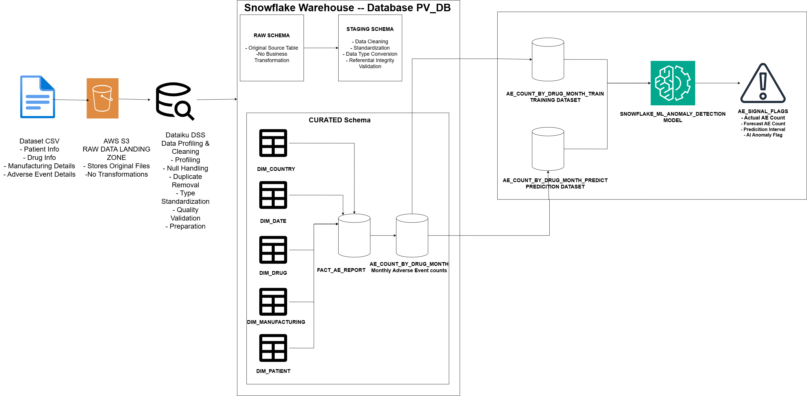

# pharmacovigilance-intelligence-platform

### From Raw Adverse Event Reports to AI-Powered Safety Signals

End-to-end data engineering pipeline that ingests adverse event (AE) reports,
cleanses them through an auditable ETL flow, models them into a production-style
star schema, and applies ML-based anomaly detection to flag unusual drug safety signals.

## Architecture

**Stack:** AWS (S3, IAM) · Dataiku DSS · Snowflake (Warehouse, Cortex ML) · Power BI

## Pipeline
CSV → S3 (raw) → Dataiku DSS (profile/cleanse) → Snowflake RAW → STAGING → CURATED 
(star schema) → aggregation → Snowflake Cortex ML anomaly detection → Power BI

## Key Design Decisions
- **Deduplication rule:** conflicts on REPORT_ID resolved by retaining first occurrence (DQ-001)
- **Missing data policy:** PATIENT_AGE imputed with median; DOSE_AMOUNT_MG intentionally 
  left NULL rather than imputed, since dosage is clinical data and imputation could 
  mislead safety analysis (DQ-007, DQ-008)
- **Fact table grain:** one row = one AE report, validated via referential integrity 
  checks against all 5 dimensions (zero orphan records)
- **ML approach:** SNOWFLAKE.ML.ANOMALY_DETECTION on monthly/weekly AE counts by drug, 
  95% prediction interval, trained on Jan–Sep 2025, evaluated on Oct–Dec 2025

## Results
- 83 raw records → 81 after deduplication, 19 columns, zero orphaned foreign keys
- Star schema: 1 fact table (FACT_AE_REPORT) + 5 dimensions
- Flagged genuine anomalies for ONCOZEL and VASCULIN in prediction window
- Interactive Power BI dashboard with drug/country/manufacturing-site breakdowns

## Documentation
Full 48-page write-up: [docs/Pharmacovigilance Intelligence Platform Documentation.pdf](docs/Pharmacovigilance Intelligence Platform Documentation.pdf)
